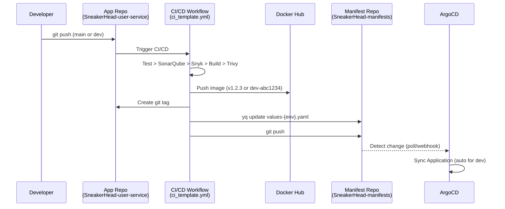
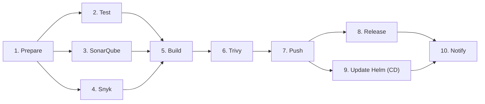

# SneakerHead — Reusable CI/CD Workflow Templates

This repository contains shared GitHub Actions workflow templates used by all SneakerHead microservices.

---

## Templates

| Template | Purpose |
|----------|---------|
| `ci_template.yml` | Full CI/CD pipeline: test, scan, build, push, update Helm values |

---

## Architecture

```
Developer --> git push --> GitHub Actions CI/CD --> Docker Hub + Manifest Repo --> ArgoCD --> Kubernetes
```

### Pipeline Flow (Single Workflow)



### Job Execution Order



### Branch to Environment Mapping

| Branch | Docker Tag Format | Values File Updated | ArgoCD Sync |
|--------|-------------------|---------------------|-------------|
| `main` | `v1.2.3` (semver) | `values-prod.yaml` | Manual |
| `dev` | `dev-abc1234` (sha) | `values-dev.yaml` | Auto |
| PR | `sha-abc1234` | Not updated | N/A |

---

## Per-Service Setup

Each microservice repo needs **1 caller workflow file**:

```
.github/workflows/
└── ci.yml    --> calls ci_template.yml (handles both CI and CD)
```

### Example: `ci.yml`

```yaml
name: CI/CD - User Service

on:
  push:
    branches: [main, dev]
  pull_request:
    branches: [main, dev]

permissions:
  contents: write
  packages: read

jobs:
  cicd:
    uses: SneakerHead-org/SneakerHead-template/.github/workflows/ci_template.yml@main
    with:
      service-name: sneakerhead-user-service    # Docker Hub image name
      sonar_project_key: SneakerHead-User-Service
      helm-service-name: user-service            # Helm values key
      chart-path: helm/sneakerhead               # path inside manifest repo
    secrets:
      SONAR_TOKEN: ${{ secrets.SONAR_TOKEN }}
      SONAR_HOST_URL: ${{ secrets.SONAR_HOST_URL }}
      SNYK_TOKEN: ${{ secrets.SNYK_TOKEN }}
      DOCKER_USERNAME: ${{ secrets.DOCKER_USERNAME }}
      DOCKER_PASSWORD: ${{ secrets.DOCKER_PASSWORD }}
      SMTP_HOST: ${{ secrets.SMTP_HOST }}
      SMTP_PORT: ${{ secrets.SMTP_PORT }}
      SMTP_USERNAME: ${{ secrets.SMTP_USERNAME }}
      SMTP_PASSWORD: ${{ secrets.SMTP_PASSWORD }}
      EMAIL_TO: ${{ secrets.EMAIL_TO }}
      APP_ID: ${{ secrets.APP_ID }}
      APP_PRIVATE_KEY: ${{ secrets.APP_PRIVATE_KEY }}
      MANIFEST_REPO: ${{ secrets.MANIFEST_REPO }}
```

### Service Name Mapping

> **Important**: `service-name` and `helm-service-name` are different.

| Repo | `service-name` (Docker) | `helm-service-name` (Helm key) |
|------|-------------------------|-------------------------------|
| SneakerHead-user-service | `sneakerhead-user-service` | `user-service` |
| SneakerHead-product-service | `sneakerhead-product-service` | `product-service` |
| SneakerHead-order-service | `sneakerhead-order-service` | `order-service` |
| SneakerHead-frontend | `sneakerhead-frontend` | `frontend` |
| SneakerHead-gateway | `sneakerhead-gateway` | `gateway` |

---

## How the CD Job Works

### Problem: How does the pipeline know which file to update?

The manifest repo has multiple folders:

```
SneakerHead-manifests/
├── argocd/         # ArgoCD Application manifests
├── helm/           # Helm charts
│   └── sneakerhead/
│       ├── values-dev.yaml     <-- target for dev branch
│       └── values-prod.yaml    <-- target for main branch
└── k8s/            # Raw K8s manifests (legacy)
```

The caller provides two inputs that pinpoint the exact file:

| Input | Value | Purpose |
|-------|-------|---------|
| `chart-path` | `helm/sneakerhead` | Folder inside the manifest repo |
| `helm-service-name` | `user-service` | Top-level key inside the values file |

The CD job builds the path: `manifest-repo/{chart-path}/values-{env}.yaml`

### What gets updated

```yaml
# In values-dev.yaml (or values-prod.yaml):
user-service:                    # <-- helm-service-name targets this key
  image:
    repository: yaswanthreddy1602/sneakerhead-user-service   # unchanged
    tag: dev-abc1234             # <-- ONLY this field is updated
```

### Image name chain

```
CI pushes to Docker Hub:           yaswanthreddy1602/sneakerhead-user-service:dev-abc1234
Helm values (after CD update):     repository: yaswanthreddy1602/sneakerhead-user-service  +  tag: dev-abc1234
K8s Deployment renders:            image: yaswanthreddy1602/sneakerhead-user-service:dev-abc1234

Docker Hub == K8s Deployment image  ✅
```

### Key advantage over separate workflow

The tag comes **directly** from `prepare.outputs.tag` — no re-derivation needed. The same tag that was used to push the Docker image is used to update the Helm values.

---

## Required Secrets (per microservice repo)

| Secret | Purpose |
|--------|---------|
| `SONAR_TOKEN` | SonarQube authentication |
| `SONAR_HOST_URL` | SonarQube server URL |
| `SNYK_TOKEN` | Snyk security scanning |
| `DOCKER_USERNAME` | Docker Hub username |
| `DOCKER_PASSWORD` | Docker Hub password/token |
| `SMTP_HOST` | Email server host |
| `SMTP_PORT` | Email server port |
| `SMTP_USERNAME` | Email auth username |
| `SMTP_PASSWORD` | Email auth password |
| `EMAIL_TO` | Notification recipient |
| `APP_ID` | GitHub App ID (cross-repo push) |
| `APP_PRIVATE_KEY` | GitHub App private key (PEM) |
| `MANIFEST_REPO` | Manifest repo name (e.g. `SneakerHead-manifests`) |

---

## What Gets Skipped on PRs

The CI/CD template handles PRs safely — these jobs are **skipped** on pull requests:

| Job | Runs on PR? | Why |
|-----|-------------|-----|
| Prepare | ✅ Yes | Generates tag for build (but `push=false`) |
| Test | ✅ Yes | Always run tests |
| SonarQube | ✅ Yes | Quality checks |
| Snyk | ✅ Yes | Security checks |
| Build | ✅ Yes | Verify image builds |
| Trivy | ✅ Yes | Scan built image |
| Push | ❌ No | Guard: `push == 'true' && (main \|\| dev)` |
| Release | ❌ No | Guard: `main && push.success` |
| Update Helm | ❌ No | Guard: `push.success` |
| Notify | ❌ No | Guard: `main` |
